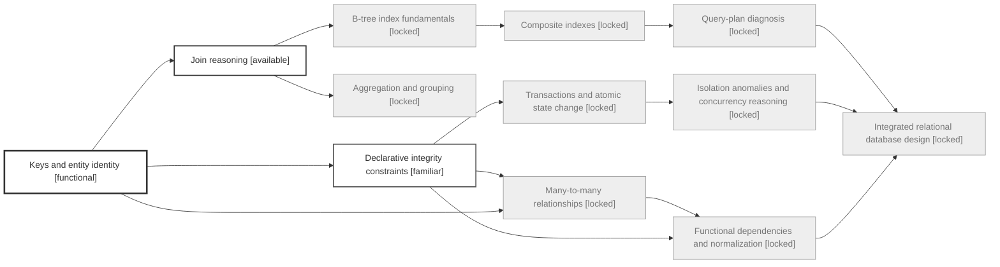

# Database Systems — learning map

Map version: **1**.

## Status

| Competency | Importance | Depth | State | Confidence | Retention |
|---|---|---|---|---|---|
| Keys and entity identity | core | foundational | functional | moderate | fresh |
| Declarative integrity constraints | core | foundational | familiar | low | fresh |
| Many-to-many relationships | core | foundational | locked | — | — |
| Functional dependencies and normalization | core | intermediate | locked | — | — |
| Join reasoning | core | foundational | available | — | — |
| Aggregation and grouping | core | intermediate | locked | — | — |
| Transactions and atomic state change | core | foundational | locked | — | — |
| Isolation anomalies and concurrency reasoning | core | advanced | locked | — | — |
| B-tree index fundamentals | core | intermediate | locked | — | — |
| Composite indexes | core | intermediate | locked | — | — |
| Query-plan diagnosis | core | advanced | locked | — | — |
| Integrated relational database design | core | advanced | locked | — | — |

## Frontier

**Available:** Join reasoning

**Review due/uncertain:** None.
